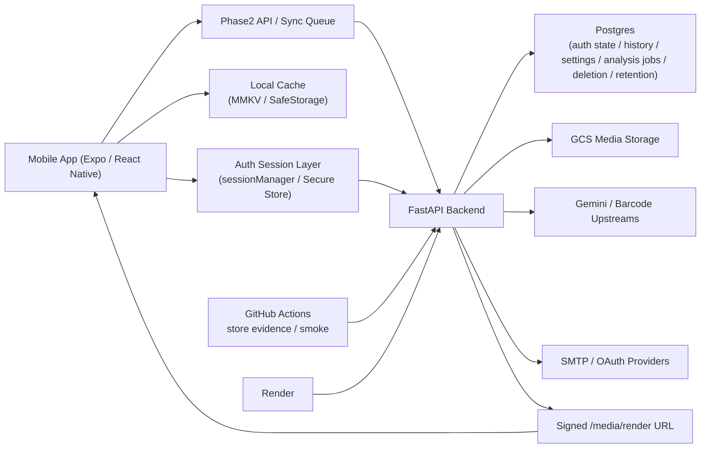
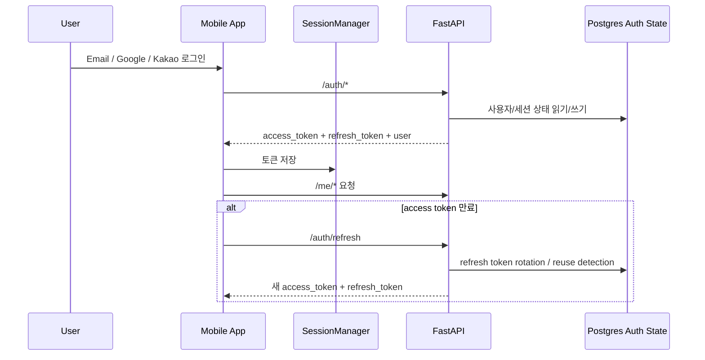
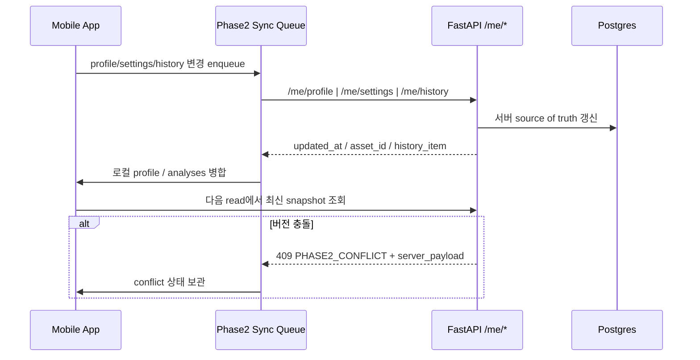
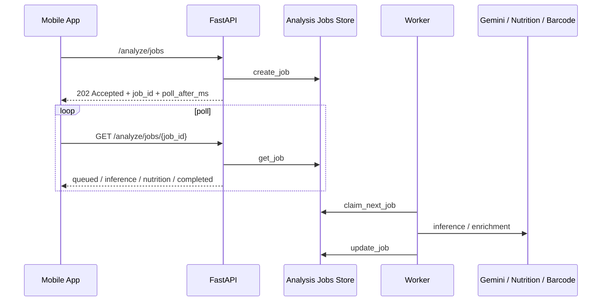
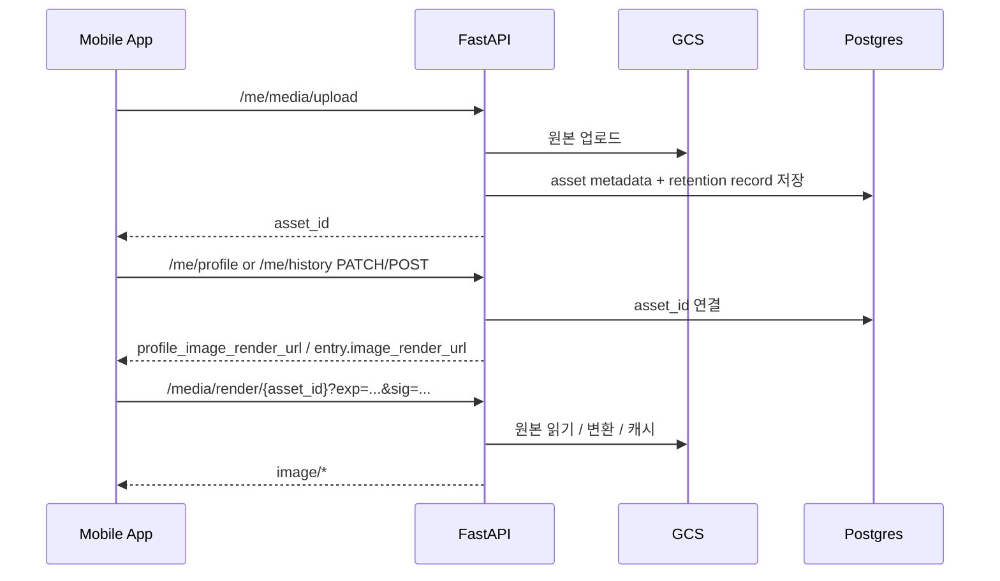
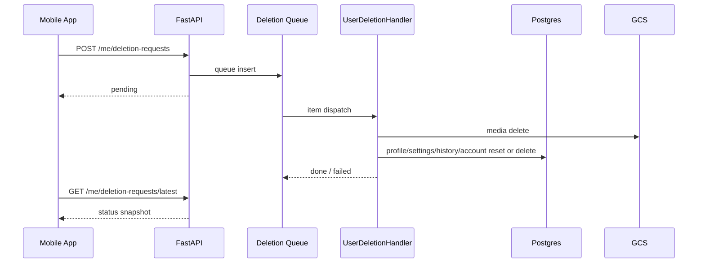

# FoodLens plan-eng-review (2026-04-09)

## 1. 결론

현재 FoodLens 아키텍처는 **Android 출시와 현재 범위 운영에는 충분히 성립**합니다. 다만 iOS 스토어 배포와 이후 확장까지 고려하면, 아래 네 축을 기준으로 더 명확하게 잠가야 합니다.

1. 인증/세션과 Phase 2 sync 경계
2. 비동기 분석 작업 큐와 poll 계약
3. 미디어 업로드/렌더/retention 생명주기
4. 삭제 요청과 release gate의 end-to-end 검증

한 줄로 요약하면, 현재 구조는 "작동한다" 단계는 넘었고, 이제는 **교차 기기·경합·삭제·운영 예외를 명시적으로 설계한 구조**로 문서와 테스트를 더 잠가야 합니다.

## 2. 리뷰 범위

- Mobile: Expo Router, auth/session, profile/settings/history sync, 실기기 release build
- Backend: FastAPI auth/analyze/media/deletion/runtime stores
- Delivery: Render, GitHub Actions release gate, rollback rehearsal, postdeploy smoke

## 3. 시스템 토폴로지

## 4. 핵심 데이터 흐름

### 4.1 로그인과 세션 복구

핵심 판단:

- 세션 소유권은 백엔드가 가지며, 모바일은 bearer/token 저장과 복구를 담당합니다.
- `refresh token rotation`과 `reuse detection`은 이미 구조적으로 들어가 있어 보안 경계는 괜찮습니다.
- 가장 민감한 지점은 `계정 전환 중 pending sync queue`입니다.

### 4.2 프로필/설정/히스토리 sync

핵심 판단:

- `expected_updated_at` 기반 낙관적 충돌 제어가 이미 있어 구조는 맞습니다.
- 로컬 캐시가 보조 계층이고 서버가 source of truth라는 점도 맞습니다.
- 다만 충돌 이후 UI가 사용자에게 무엇을 보여주는지, 계정 전환 시 queue를 어떻게 소유권 분리하는지 테스트가 더 필요합니다.

### 4.3 분석 요청과 비동기 작업 큐

핵심 판단:

- 최근 `create_job SQL mismatch`, `claim deadlock`, `submit observability`까지 손본 결과 현재 구조는 안정화됐습니다.
- 그래도 모바일이 `poll_after_ms`와 `Retry-After`를 엄격히 따르지 않으면 운영 노이즈가 커질 수 있습니다.
- worker 수가 `1`인 starter plan 기준이라 처리량 상한은 명확합니다.

### 4.4 미디어 업로드와 signed render

핵심 판단:

- 최근 `bare filename` 누수를 막아서 서버 원격 참조와 로컬 파일 참조가 분리됐습니다.
- 이 경계는 지금 구조에서 매우 중요합니다. 서버는 asset-backed render URL만 truth로 가져가야 합니다.
- orphan asset, expired signed URL, cross-device history image 재생성은 계속 중요한 예외입니다.

### 4.5 Delete My Data / Delete Account

핵심 판단:

- queue와 status store가 분리돼 있어 구조는 괜찮습니다.
- 하지만 mobile UI -> queue -> handler -> status -> logout까지 한 번에 묶는 end-to-end 테스트는 아직 약합니다.

## 5. 아키텍처 강점

1. **서버 source of truth와 모바일 보조 캐시의 경계가 비교적 명확합니다.**
2. **auth/media/analysis/deletion을 별도 runtime store와 스크립트로 쪼개 운영하고 있어, release gate와 연결하기 좋습니다.**
3. **release gate, postdeploy smoke, rollback rehearsal까지 실제 운영 경로가 이미 존재합니다.**

## 6. 주요 리스크

### R1. 계정 전환 + pending sync queue 경합

- 계정 A의 미전송 작업이 남아 있는 상태에서 계정 B로 바뀌면 잘못된 소유권으로 write가 시도될 수 있습니다.
- 현재 구조상 `userId`를 operation에 저장하고 있지만, 실제 UI 흐름에서 충분히 반복 검증돼야 합니다.

### R2. poll 계약 미준수 시 운영 노이즈 증가

- `/analyze/jobs`는 `poll_after_ms`와 429/503 계약이 중요합니다.
- aggressive polling은 실제 장애처럼 보이는 429/502 노이즈를 만들 수 있습니다.

### R3. media asset lifecycle 불완전성

- upload 성공 후 profile/history 연결 실패
- signed render URL 만료 후 stale cache 재사용
- orphan asset cleanup 누락

이 세 가지는 사용자 눈에 "이미지가 사라진다"로 보일 수 있습니다.

### R4. deletion과 sync queue의 충돌

- Delete My Data / Delete Account 처리 중 앱이 다시 온라인이 되면 pending sync가 재업로드를 시도할 수 있습니다.
- 삭제 완료 직후 클라이언트 상태 초기화와 세션 무효화가 반드시 같은 흐름으로 묶여야 합니다.

### R5. starter plan 단일 worker 병목

- `ANALYSIS_JOB_WORKER_COUNT=1`은 현재 출시에는 가능하지만, burst가 오면 queue latency와 timeout 리스크가 커집니다.

## 7. 예외 상황 체크리스트

다음 10개는 문서와 테스트 모두에서 명시적으로 다뤄야 합니다.

1. 이메일 가입 직후 인증 미완료 상태에서 재로그인/재가입
2. refresh token 재사용 탐지 후 세션 패밀리 무효화
3. 계정 전환 중 pending profile/settings/history sync
4. history entry가 local image만 들고 있을 때 cross-device 동기화
5. signed render URL 만료 후 히스토리 재열람
6. media upload 성공 후 `PATCH /me/history/{id}/image` 실패
7. `/analyze/jobs` submit 성공 후 poll 중 429/503/502 발생
8. rollback kill switch 적용 중 inflight analysis job 존재
9. Delete My Data 실행 중 mobile이 다시 queue dispatch 수행
10. smoke 계정의 remote media asset 부재로 smoke가 무의미해지는 경우

## 8. 현재 테스트/검증 기반

현재 확인되는 테스트 기반은 괜찮습니다.

### 8.1 백엔드 runtime 테스트

- auth: `test_auth_phase1.py`, `test_auth_service_rotation.py`, `test_auth_phase2_data.py`
- analysis jobs / observability: `test_analysis_jobs.py`, `test_analysis_observability.py`
- media: `test_media_render_runtime.py`, `test_media_storage_resilience.py`
- deletion / retention: `test_deletion_queue.py`, `test_data_retention.py`
- rollout / operational config: `test_rollout_control.py`, `test_phase4_operational_config.py`

### 8.2 모바일 sync 테스트

- `phase2Api.test.ts`
- `phase2ConflictResolution.test.ts`
- `phase2Mappers.test.ts`
- `phase2SyncQueue.test.ts`
- `clientState.test.ts`

### 8.3 운영 검증

- Android/iOS 실기기 release build 스크립트
- store evidence workflow
- postdeploy smoke workflow
- rollback rehearsal

현재 한계:

- PR required check는 auth/runtime/contract/sync 쪽이 상대적으로 강하지만, `analysis_jobs` 런타임 검증은 아직 같은 수준의 필수 게이트로 고정돼 있지 않습니다.
- 현재 postdeploy smoke는 `/`, provider redirect, `/me/*`, signed media render는 보지만 `POST /analyze/jobs -> poll` 경로는 아직 포함하지 않습니다.

## 9. 부족한 테스트

우선순위는 이 순서가 맞습니다.

### P0

1. 계정 전환 회귀
   - `Google A -> logout -> Kakao -> logout -> Google B`
   - queue와 local cache ownership까지 포함
2. deletion end-to-end
   - mobile UI -> deletion request -> status -> local/session cleanup
3. media end-to-end
   - upload -> asset_id attach -> history/profile render -> signed URL expiry 후 재조회
4. async analysis polling contract
   - client가 `poll_after_ms`, 429 `Retry-After`를 따르는지 검증
   - postdeploy smoke에도 최소 1세트 `submit -> poll -> completed`를 넣는 것이 맞습니다

### P1

5. profile/settings/history conflict UI 처리
6. orphan asset cleanup / retry path
7. rollback 중 inflight analysis job 영향
8. smoke 계정 asset absence를 사전에 검증하는 contract test

### P2

9. low-connectivity / offline -> reconnect burst
10. single worker queue saturation under staged rollout

## 10. 권장 테스트 매트릭스

| 레이어 | 이미 있음 | 추가 권장 |
| --- | --- | --- |
| Backend unit/runtime | auth, media, jobs, deletion, rollout | queue saturation, orphan media, deletion-sync race |
| Mobile unit | sync mapper/queue/conflict | polling contract, account switch ownership |
| Mobile E2E | release smoke 일부 수동 | login-provider switch, deletion flows, media expiry |
| Ops/Release | postdeploy smoke, rollback rehearsal | smoke preflight for media-backed account, staged rollout KPI gate evidence |

## 11. 권장 결정

### 지금 유지해도 되는 것

- FastAPI + Postgres + GCS + Render 기본 구조
- Phase 2 source-of-truth 방향
- signed media render 모델
- workflow_dispatch 기반 postdeploy smoke

### 지금 바로 잠가야 하는 것

1. `계정 전환 + sync queue` 자동 회귀
2. `Delete My Data / Delete Account` end-to-end 테스트
3. `poll_after_ms / Retry-After`를 따르는 클라이언트 검증
4. smoke 계정 준비 상태 preflight

## 12. 최종 판단

**STATUS: PROCEED_WITH_TARGETED_HARDENING**

현재 아키텍처를 뒤엎을 이유는 없습니다. 다만 출시 이후 가장 먼저 문제를 만들 가능성이 높은 영역은 대형 구조 문제가 아니라, **경합·예외·운영 계약을 테스트로 잠그지 않은 부분**입니다.

그래서 다음 단계는 "새 아키텍처 설계"가 아니라 다음 네 가지를 문서와 테스트로 고정하는 것입니다.

1. 계정 전환
2. 삭제 흐름
3. 미디어 생명주기
4. 비동기 poll 계약
