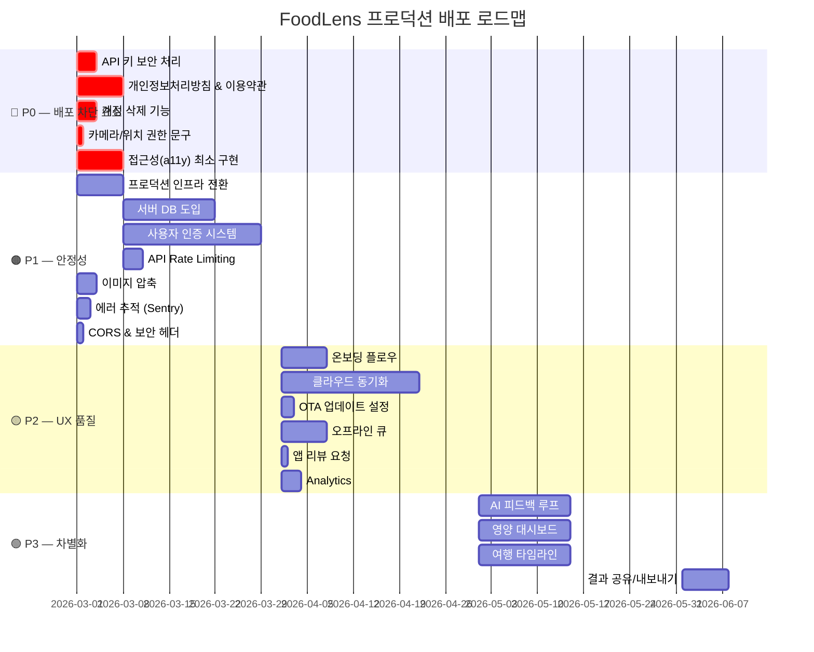

# 🔬 FoodLens CTO 전수검사 보고서 (Production Edition)

> **검사 범위**: 프론트엔드(React Native / Expo 54) + 백엔드(FastAPI / Python) + AI(Gemini) 전체
> **목표**: **App Store / Play Store 배포 후 실제 사용자 서비스 제공**
> **검사일**: 2026-02-18 (v2 — 프로덕션 배포 관점 반영)

---

## 📊 현재 아키텍처 요약

| 계층          | 기술 스택                                                                | 상태                         |
| ------------- | ------------------------------------------------------------------------ | ---------------------------- |
| **Frontend**  | Expo 54, React 19, React Native 0.81, TanStack Query, Reanimated 4, Skia | ✅ 기능 완성도 높음          |
| **Backend**   | FastAPI, Python 3.11, Docker                                             | ⚠️ Render 무료 티어, DB 없음 |
| **AI Engine** | Google Gemini, 2-Pass Label Analysis, Smart Router                       | ✅ 프롬프트 엔지니어링 우수  |
| **Storage**   | MMKV + AsyncStorage (로컬 전용)                                          | 🔴 서버 DB 없음              |
| **Infra**     | Render Free Tier, 단일 인스턴스                                          | 🔴 프로덕션 부적합           |

---

## 🔴 Part 1: 프로덕션 배포 필수 (App Store 심사 통과 요건)

> [!CAUTION]
> 이 섹션의 항목들은 **App Store / Play Store 심사에서 리젝 사유가 되는 필수 요건**입니다.

---

### 1. 🔑 API 키 하드코딩 노출 — **보안 Critical**

| 항목     | 현재 상태                                                                                                                      |
| -------- | ------------------------------------------------------------------------------------------------------------------------------ |
| **파일** | [.env](file:///Users/beatlefeed/Documents/FoodLens-project/FoodLens/.env)                                                      |
| **문제** | `GOOGLE_API_KEY`, `EXPO_PUBLIC_GEMINI_API_KEY`, `FIREBASE_API_KEY`가 `.env`에 평문 노출. `.env`가 `.gitignore`에 미포함 가능성 |
| **위험** | API 키 탈취 → 무제한 Gemini 호출 비용 발생, Firebase 프로젝트 침해                                                             |
| **조치** | ① `.env`를 `.gitignore`에 추가 ② `EXPO_PUBLIC_*` 키는 클라이언트 빌드에 포함되므로 서버 프록시로 전환 ③ API 키 로테이션        |

---

### 2. 📜 개인정보처리방침 & 이용약관 화면 없음

| 항목            | 현재 상태                                                                                                                                             |
| --------------- | ----------------------------------------------------------------------------------------------------------------------------------------------------- |
| **문제**        | 앱 내 Privacy Policy, Terms of Service 화면 부재                                                                                                      |
| **Apple 요건**  | [App Store Review Guideline 5.1.1](https://developer.apple.com/app-store/review/guidelines/#data-collection-and-storage) — 개인정보처리방침 링크 필수 |
| **Google 요건** | Play Console에서 최초 출시 시 개인정보처리방침 URL 필수 입력                                                                                          |
| **조치**        | ① 개인정보처리방침 웹페이지 작성 ② 앱 내 Profile/Settings에서 링크 노출 ③ 앱 최초 실행 시 동의 화면                                                   |

---

### 3. 🗑️ 계정 삭제 기능 없음 — **Apple 필수 요건**

| 항목           | 현재 상태                                                                                                         |
| -------------- | ----------------------------------------------------------------------------------------------------------------- |
| **Apple 요건** | [2022.06.30 이후](https://developer.apple.com/support/offering-account-deletion-in-your-app/) 계정 삭제 기능 필수 |
| **문제**       | 사용자 데이터(프로필, 분석기록, 이미지) 일괄 삭제 기능 없음                                                       |
| **조치**       | Profile 화면에 "계정 삭제" 버튼 → 전체 로컬 데이터 + 서버 데이터 삭제 플로우 구현                                 |

---

### 4. 📸 카메라/위치 권한 설명 문구 미비

| 항목           | 현재 상태                                                                                   |
| -------------- | ------------------------------------------------------------------------------------------- |
| **파일**       | [app.config.js](file:///Users/beatlefeed/Documents/FoodLens-project/FoodLens/app.config.js) |
| **문제**       | `expo-camera` 플러그인 설정 누락 (카메라 권한 문구 없음), `expo-location` 권한 문구 없음    |
| **Apple 요건** | `NSCameraUsageDescription`, `NSLocationWhenInUseUsageDescription` 미설정 시 리젝            |
| **조치**       | `app.config.js`의 `plugins`에 카메라/위치 권한 설명 추가                                    |

---

### 5. ♿ 접근성(Accessibility) 완전 부재

| 항목           | 현재 상태                                                                           |
| -------------- | ----------------------------------------------------------------------------------- |
| **문제**       | 전체 앱에서 `accessibilityLabel`, `accessibilityRole`, `accessibilityHint` 사용 0건 |
| **Apple 요건** | VoiceOver 지원은 심사 항목. 주요 인터랙티브 요소에 최소한 Label 필요                |
| **조치**       | 모든 버튼, 이미지, 입력 필드에 `accessibilityLabel` 추가                            |

---

## 🟠 Part 2: 프로덕션 안정성 (서비스 중단 방지)

> [!WARNING]
> 이 섹션은 앱 출시 후 **서비스 안정성과 비용 관리**에 직접 영향을 미칩니다.

---

### 6. 🖥️ Render 무료 티어 → 프로덕션 인프라 전환

| 항목     | 현재 상태                                                                                 |
| -------- | ----------------------------------------------------------------------------------------- |
| **문제** | Render Free Tier = 15분 비활성 시 스핀다운, 디스크 휘발성, 메모리 512MB, Cold Start ~50초 |
| **영향** | 사용자가 앱 열면 첫 분석까지 1분 대기 → **즉시 이탈**                                     |
| **조치** | Render Paid ($7/mo) 또는 **Google Cloud Run** / **Railway** 전환. 최소 Always-On 인스턴스 |

---

### 7. 💾 서버 DB 도입 (InMemory → PostgreSQL)

| 항목     | 현재 상태                                                                          |
| -------- | ---------------------------------------------------------------------------------- |
| **파일** | [server.py](file:///Users/beatlefeed/Documents/FoodLens-project/backend/server.py) |
| **문제** | 비용 가드레일, 롤아웃 상태, 리텐션 스토어가 모두 `InMemory*` — 재시작 시 초기화    |
| **조치** | Supabase (무료 500MB) 또는 Neon PostgreSQL 도입                                    |

---

### 8. 🔐 사용자 인증 시스템

| 항목     | 현재 상태                                                 |
| -------- | --------------------------------------------------------- |
| **문제** | `device_` + 랜덤 문자열이 유일한 식별자. 서버측 인증 없음 |
| **영향** | API 무제한 호출 가능 → Gemini 비용 폭증, 데이터 보호 불가 |
| **조치** | Firebase Auth (Google/Apple Sign-In) + JWT 미들웨어       |

---

### 9. 🚦 API Rate Limiting

| 항목     | 현재 상태                                                                       |
| -------- | ------------------------------------------------------------------------------- |
| **문제** | `/analyze`, `/analyze/label`, `/analyze/smart`에 per-user rate limit 없음       |
| **조치** | `slowapi` 또는 Cloudflare Rate Limiting. IP + deviceId 기준 분당 10회 제한 권장 |

---

### 10. 🖼️ 이미지 업로드 전 압축

| 항목     | 현재 상태                                                      |
| -------- | -------------------------------------------------------------- |
| **문제** | 12MP 원본 이미지 그대로 서버 전송 (~4MB/요청)                  |
| **영향** | 모바일 데이터 소모 과다, 서버 처리 지연, Gemini 토큰 비용 증가 |
| **조치** | `expo-image-manipulator`로 1024px 리사이즈 + JPEG 80% 압축     |

---

### 11. 🛡️ CORS & 보안 헤더

| 항목     | 현재 상태                                                                     |
| -------- | ----------------------------------------------------------------------------- |
| **문제** | CORS 미들웨어 미적용, Security headers 없음                                   |
| **조치** | `CORSMiddleware` 추가 + `X-Content-Type-Options`, `Strict-Transport-Security` |

---

### 12. 📊 에러 추적 (Sentry / Crashlytics)

| 항목     | 현재 상태                                                           |
| -------- | ------------------------------------------------------------------- |
| **문제** | `ErrorBoundary`가 `console.error`만 호출. 프로덕션 크래시 추적 불가 |
| **조치** | Sentry React Native SDK + 백엔드 Sentry Python SDK                  |

---

## 🟡 Part 3: 사용자 경험 & 리텐션 (출시 품질)

> [!IMPORTANT]
> 실제 사용자에게 제공 시 **이탈률과 리텐션에 직접 영향**을 미치는 항목입니다.

---

### 13. 🎓 온보딩 플로우

| 항목     | 상세                                                                  |
| -------- | --------------------------------------------------------------------- |
| **기능** | 최초 실행 시 앱 소개(3~4 슬라이드) → 알레르기 설정 → 카메라 권한 안내 |
| **이유** | 현재 앱은 곧바로 홈 화면으로 진입. 핵심 가치 전달 실패                |

---

### 14. ☁️ 클라우드 히스토리 동기화

| 항목     | 상세                                      |
| -------- | ----------------------------------------- |
| **기능** | 분석 기록 서버 저장 + 디바이스 간 동기화  |
| **이유** | 앱 삭제/디바이스 교체 시 전체 데이터 손실 |
| **구현** | Supabase Realtime 또는 Firebase Firestore |

---

### 15. 📤 OTA 업데이트 (EAS Update)

| 항목     | 상세                                           |
| -------- | ---------------------------------------------- |
| **기능** | 스토어 심사 없이 JS 번들 긴급 업데이트         |
| **이유** | 현재 `eas.json`에 `update` 채널 미설정         |
| **구현** | `expo-updates` 플러그인 + EAS Update 채널 설정 |

---

### 16. 🔄 오프라인 큐 & 재시도

| 항목     | 상세                                                            |
| -------- | --------------------------------------------------------------- |
| **기능** | 네트워크 불안정 시 분석 요청 큐잉 → 복구 후 자동 재시도         |
| **이유** | 해외 여행 중 불안정한 네트워크 환경에서 사용하는 앱의 핵심 요건 |

---

### 17. ⭐ 앱 리뷰 요청 프롬프트

| 항목     | 상세                                     |
| -------- | ---------------------------------------- |
| **기능** | 분석 5회 이상 사용 후 StoreKit 리뷰 요청 |
| **구현** | `expo-store-review` 패키지 활용          |

---

### 18. 📊 앱 Analytics

| 항목     | 상세                                            |
| -------- | ----------------------------------------------- |
| **기능** | 화면 조회수, 분석 완료율, 기능별 사용 빈도 추적 |
| **이유** | 사용자 행동 데이터 없이 서비스 개선 불가        |
| **구현** | Firebase Analytics 또는 PostHog                 |

---

## 🟢 Part 4: 서비스 차별화 기능 (Phase 2+)

---

### 19. 📊 AI 분석 피드백 루프 (Good/Bad 평가)

- AI 정확도 개선을 위한 사용자 피드백 수집

### 20. 🗺️ 여행 타임라인 뷰

- 일정별 분석 기록 시간순 타임라인 + 지도 경로

### 21. 📈 영양 대시보드 & 트렌드 차트

- 일간/주간 칼로리·탄단지 섭취 추이 (`WeeklyStatsStrip` 현재 거의 빈 파일)

### 22. 📤 분석 결과 공유/내보내기

- SNS 공유, PDF 저장, 의사 상담용 리포트

### 23. 🔔 푸시 알림 & 여행지 알레르기 주의보

- `expo-notifications` + FCM 연동

### 24. 📷 멀티 이미지 분석

- 라벨 앞면+뒷면 동시 촬영, 여러 음식 일괄 분석

### 25. 🍽️ 레스토랑 메뉴 스캔 모드

- 메뉴판 전체 OCR → 알레르겐 일괄 분석

### 26. 🎤 음성 입력 & TTS 결과 읽기

- `autoPlayAudio` 설정 이미 존재하나 TTS 미구현

### 27. 🤝 동행자 프로필 관리

- 가족/친구 알레르기 프로필 복수 등록 + 동시 안전 체크

### 28. 📍 위치 기반 안전 음식점 추천

- GPS + 알레르기 프로필 + Google Places API

### 29. 🏆 게이미피케이션 (스캔 뱃지, 여행 레벨)

- 사용자 참여도 및 리텐션 극대화

### 30. 📋 식재료 사전 & 위험 DB

- `ingredients.ts`(28KB) 데이터를 검색 가능한 사전 UI로 노출

### 31. 🔄 앱 위젯 (iOS Widget / Android Widget)

- 홈 화면에서 빠른 카메라 분석 실행

---

## 📋 프로덕션 배포 우선순위 로드맵

---

## ⚡ 핵심 체크리스트 (배포 전 최소 요건)

| #   | 항목             | 현재                | 필요                    | 우선순위 |
| --- | ---------------- | ------------------- | ----------------------- | -------- |
| 1   | API 키 보안      | 🔴 평문 노출        | 서버 프록시             | **P0**   |
| 2   | 개인정보처리방침 | 🔴 없음             | 웹페이지 + 앱 내 링크   | **P0**   |
| 3   | 계정 삭제        | 🔴 없음             | 프로필 > 삭제 버튼      | **P0**   |
| 4   | 권한 설명 문구   | 🔴 카메라/위치 누락 | `app.config.js` 설정    | **P0**   |
| 5   | 접근성           | 🔴 0건              | 주요 요소 Label 추가    | **P0**   |
| 6   | 인프라           | 🔴 Free Tier        | Always-On 인스턴스      | **P1**   |
| 7   | 인증             | 🔴 없음             | Firebase/Supabase Auth  | **P1**   |
| 8   | DB               | 🔴 InMemory         | PostgreSQL/Supabase     | **P1**   |
| 9   | Rate Limit       | 🔴 없음             | per-user 쓰로틀링       | **P1**   |
| 10  | Crash 추적       | 🔴 console만        | Sentry 연동             | **P1**   |
| 11  | 이미지 압축      | ⚠️ 없음             | expo-image-manipulator  | **P1**   |
| 12  | 온보딩           | ⚠️ 없음             | 3~4슬라이드 + 권한 안내 | **P2**   |
| 13  | OTA 업데이트     | ⚠️ 미설정           | EAS Update 채널         | **P2**   |
| 14  | Analytics        | ⚠️ 없음             | Firebase Analytics      | **P2**   |

---

> **CTO 소견**: FoodLens는 AI 분석 로직·프롬프트 엔지니어링·UX 애니메이션의 완성도가 높은 프로젝트입니다. 그러나 **실제 사용자에게 배포하려면 P0 항목 5건은 반드시 해결**해야 합니다. 특히 API 키 노출은 금전적 피해로 직결되며, 개인정보처리방침/계정삭제 부재는 스토어 심사 리젝 사유입니다. P0 → P1 → P2 순서로 진행하면, 약 **6~8주 내 프로덕션 배포 가능**할 것으로 판단됩니다.
