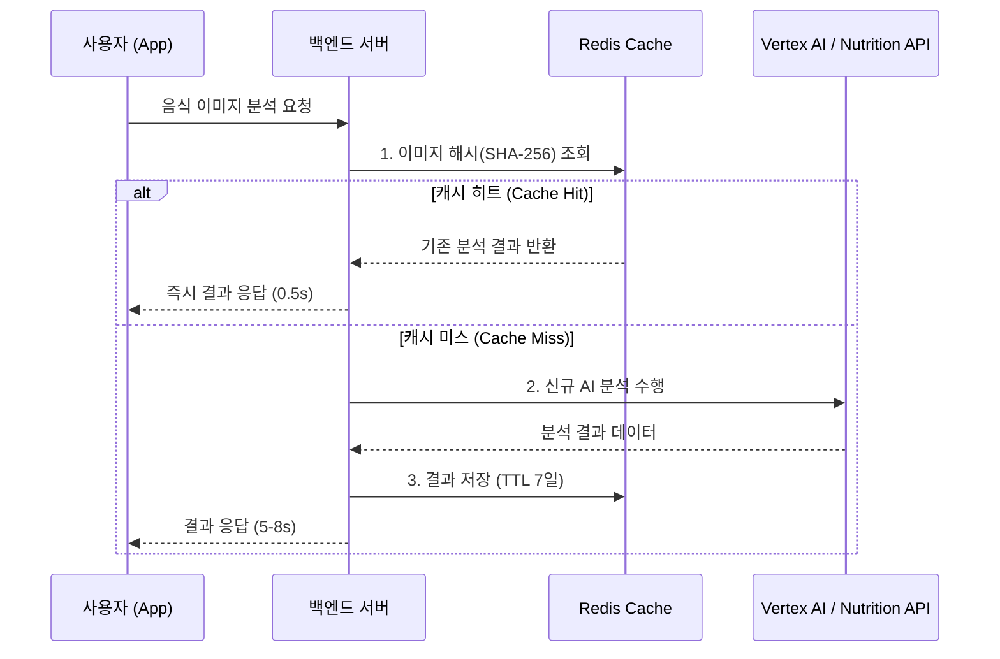

# FoodLens Redis 캐싱 레이어 상세 설계서 (Redis Caching Design)

> **목표**: 중복된 AI 분석 요청을 차단하여 Vertex AI 호출 비용을 **30% 이상 절감**하고, 평균 응답 시간을 **5초에서 0.5초 이내**로 단축합니다.

---

## 1. 시스템 아키텍처 (System Architecture)

Redis는 Python 백엔드(Render)와 AI 모델(Vertex AI) 사이에서 **Write-Through** 방식의 캐시 레이어로 동작합니다.

---

## 2. 2단계 캐싱 전략 (Two-Tier Caching)

단순 이미지 매칭뿐만 아니라, 데이터 특성에 따른 단계별 캐싱을 적용합니다.

### **[Tier 1] 이미지 지문 캐싱 (Exact Image Cache)**

가장 강력한 비용 절감 수단입니다.

- **Key 형식**: `food_img:{sha256_hash}`
- **Value**: AI 분석 완료된 전체 JSON 데이터
- **효과**: 동일한 이미지를 다시 분석할 경우 AI 호출 비용 **0원**.

### **[Tier 2] 의미론적 영양 캐싱 (Semantic Nutrition Cache)**

이미지는 달라도 음식 이름이 같으면 영양 정보는 동일하다는 점을 이용합니다.

- **Key 형식**: `food_nut:{food_name_slug}:{iso_code}`
- **Value**: 탄단지, 칼로리 등 영양 성분 데이터 (Enriched Data)
- **효과**: AI가 음식을 판별한 후, 외부 영양 API(FatSecret 등)를 호출하는 지연 시간과 할당량 소모를 방지.

---

## 3. 데이터 설계 (Data Schema)

| Key Pattern          | Data Type     | Expiration (TTL) | 비고                             |
| :------------------- | :------------ | :--------------- | :------------------------------- |
| `img_hash:[hash]`    | String (JSON) | 7 Days           | 전체 분석 결과 캐시              |
| `nut:[name_slug]`    | String (JSON) | 30 Days          | 영양 성분 데이터 (비교적 고정적) |
| `stats:usage:[date]` | Hash          | Permanent        | 일일 비용 절감 통계 트래킹       |

---

## 4. 핵심 기술 사양 (Technical Specs)

### **이미지 매칭 알고리즘**

1. **SHA-256 (Strict)**: 바이트 단위로 100% 일치하는 이미지 처리.
2. **Perceptive Hashing (pHash)**: _향후 확장._ 밝기나 크기가 약간 조절된 비슷한 사진을 감지하여 동일한 결과를 제공 (추가 비용 절감 가능).

### **캐시 무효화 (Invalidation)**

- 모델 업데이트(`gemini-1.5` -> `2.0`) 시 전체 캐시 갱신 기능을 포함합니다.
- 특정 음식의 영양 정보 오류 신고 시 해당 `nut:` 키만 선별 삭제 가능하도록 설계합니다.

---

## 5. 기대 효과 (Expected ROI)

### **비용 측면 (Cost)**

- **재분석 차단**: 커뮤니티 공유 사진이나 중복 요청에 대해 **AI 비용 100% 절감**.
- **영양 API 할당량**: 무료 API(FatSecret 등)의 일일 호출 한도 문제를 해결하여 서비스 안정성 확보.

### **성능 측면 (Performance)**

- **응답 속도**:
  - AI 호출 시: ~6.0s
  - Redis 히트 시: **~0.1s** (체감 속도 60배 향상)

---

## 6. 구현 우선순위 (Implementation Roadmap)

1.  **Phase 1**: `redis-py` 라이브러리 연동 및 Render 전용 Upstash Redis (무료 티어) 설정.
2.  **Phase 2**: `analyst.py` 내 `analyze_food_json` 함수 시작 부분에 캐시 체크 로직 삽입.
3.  **Phase 3**: 분석 완료 시점에 Redis 저장 로직 구현.
4.  **Phase 4**: 캐시 히트율(Hit Rate)을 모니터링하기 위한 간단한 통계 로그 추가.
