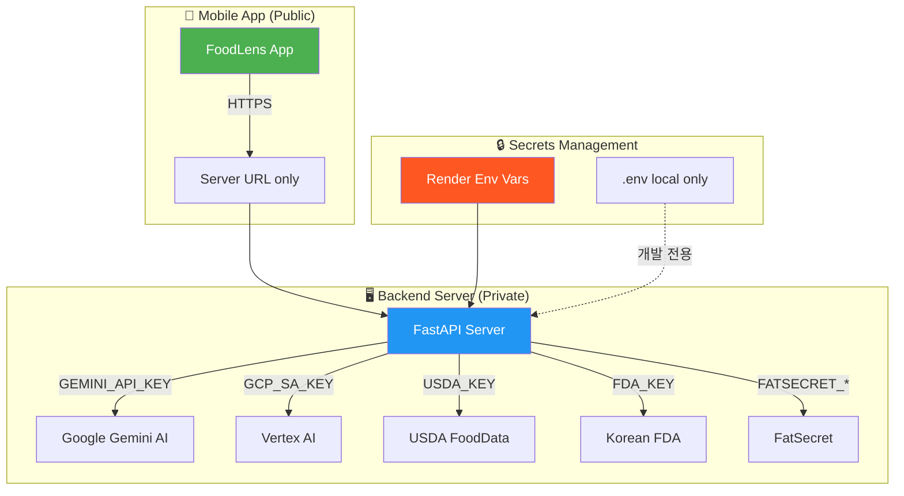

# 🔐 API 키 보안 조치 — CTO 실무 액션 플랜

> **심각도**: 🔴 Critical  
> **예상 소요**: 1~2일 (집중 작업 기준)  
> **전제**: 이 키들이 Git에 커밋된 적이 있다면, **이미 유출된 것으로 간주**

---

## 🔍 현재 노출 현황 (전수 조사 결과)

| #   | 시크릿                                          | 파일                                                                                     | 위험도       |
| --- | ----------------------------------------------- | ---------------------------------------------------------------------------------------- | ------------ |
| 1   | **GCP Service Account Private Key** (전체 JSON) | [root .env](file:///Users/beatlefeed/Documents/FoodLens-project/.env) L9                 | 🔴 최고위험  |
| 2   | **Gemini API Key** (`AIzaSyAZPV...`)            | [FoodLens/.env](file:///Users/beatlefeed/Documents/FoodLens-project/FoodLens/.env) L1,4  | 🔴 비용 폭증 |
| 3   | **Firebase Config Keys**                        | [FoodLens/.env](file:///Users/beatlefeed/Documents/FoodLens-project/FoodLens/.env) L7-10 | 🟡 제한적    |
| 4   | **USDA API Key**                                | [root .env](file:///Users/beatlefeed/Documents/FoodLens-project/.env) L2                 | 🟠           |
| 5   | **Korean FDA API Key**                          | [root .env](file:///Users/beatlefeed/Documents/FoodLens-project/.env) L3                 | 🟠           |
| 6   | **FatSecret Client ID + Secret**                | [root .env](file:///Users/beatlefeed/Documents/FoodLens-project/.env) L4-5               | 🟠           |
| 7   | **DataGo API Key**                              | [root .env](file:///Users/beatlefeed/Documents/FoodLens-project/.env) L12                | 🟡           |
| 8   | **GitHub PAT**                                  | [root .env](file:///Users/beatlefeed/Documents/FoodLens-project/.env) L16                | 🔴 코드 탈취 |

> [!CAUTION]
> `FoodLens/.gitignore`에 `.env`가 포함되어 있지 **않습니다** (`.env*.local`만 무시).
> 즉, `FoodLens/.env`는 **Git에 추적 중**일 가능성이 높습니다.

---

## 📋 단계별 조치 계획

### Phase 1: 긴급 차단 (즉시, 30분)

#### Step 1-1. Git 히스토리 확인

```bash
# 프로젝트 루트에서 실행
git log --all --oneline -- .env FoodLens/.env
```

커밋이 하나라도 있다면 → **모든 키가 유출된 것으로 간주**하고 Step 1-2로 즉시 진행

#### Step 1-2. 유출된 키 즉시 무효화 (로테이션)

**실행 순서** (피해 규모 순):

| 순서 | 키                              | 조치 방법                                                                                       |
| ---- | ------------------------------- | ----------------------------------------------------------------------------------------------- |
| ①    | GCP Service Account             | [Google Cloud Console](https://console.cloud.google.com) → IAM → 해당 SA → 키 삭제 → 새 키 생성 |
| ②    | GitHub PAT                      | [GitHub Settings](https://github.com/settings/tokens) → 해당 토큰 Revoke → 새 토큰 발급         |
| ③    | Gemini API Key                  | Google Cloud Console → API & Services → Credentials → 키 삭제 → 새 키 생성                      |
| ④    | Firebase API Key                | Firebase Console에서 키 자체는 제한 설정 (앱 번들 ID/도메인 제한 추가)                          |
| ⑤    | USDA / FDA / FatSecret / DataGo | 각 서비스 대시보드에서 키 재발급                                                                |

#### Step 1-3. `.gitignore` 즉시 수정

```diff
# FoodLens/.gitignore 에 추가
 # local env files
-.env*.local
+.env
+.env*.local
+.env.production
+.env.development

# 프로젝트 루트 .gitignore 확인 (.env 이미 포함됨 — OK)
```

#### Step 1-4. Git 히스토리에서 `.env` 파일 제거

```bash
# git-filter-repo 사용 (권장)
pip install git-filter-repo
git filter-repo --path .env --path FoodLens/.env --invert-paths

# 또는 BFG Repo Cleaner
bfg --delete-files .env
git reflog expire --expire=now --all && git gc --prune=now --aggressive

# Force push (팀원에게 사전 고지 필수)
git push origin --force --all
```

> [!WARNING]
> `git filter-repo`는 **Git 히스토리를 재작성**합니다. 팀원 전원에게 사전 통지 후, clone을 새로 받도록 안내해야 합니다.

---

### Phase 2: 아키텍처 분리 (1일)

현재 문제의 근본 원인은 **프론트엔드가 API 키를 직접 보유하는 구조**입니다.

#### Step 2-1. 프론트엔드에서 API 키 완전 제거

**현재 구조** (위험):

```
📱 App (FoodLens/.env)
├─ EXPO_PUBLIC_GEMINI_API_KEY → Gemini 직접 호출
├─ EXPO_PUBLIC_FIREBASE_API_KEY → Firebase 직접 접근
└─ EXPO_PUBLIC_ANALYSIS_SERVER_URL → 백엔드 URL
```

**목표 구조** (안전):

```
📱 App
└─ EXPO_PUBLIC_ANALYSIS_SERVER_URL만 보유 (서버 URL)
       │
       ▼
🖥️ Backend (server.py)
├─ GEMINI_API_KEY (환경변수)
├─ GCP_SERVICE_ACCOUNT (환경변수)
├─ USDA_API_KEY (환경변수)
└─ 모든 외부 API 호출을 서버가 프록시
```

**구체적 변경**:

| 파일                                       | 변경                                            |
| ------------------------------------------ | ----------------------------------------------- |
| `FoodLens/.env`                            | `EXPO_PUBLIC_ANALYSIS_SERVER_URL` 한 줄만 유지  |
| `FoodLens/services/aiCore/serverConfig.ts` | 변경 없음 (이미 서버 URL만 사용)                |
| `FoodLens/services/aiCore/constants.ts`    | `DEFAULT_SERVER_URL`을 빌드타임 환경변수로 전환 |
| `backend/.env` (서버환경)                  | Render Dashboard의 Environment Variables에 설정 |

#### Step 2-2. 백엔드 환경변수를 호스팅 대시보드로 이전

코드에 `.env` 파일을 두지 않고, **Render Dashboard**에서 직접 설정:

```
Render Dashboard → Settings → Environment Variables

GEMINI_MODEL_NAME=gemini-2.5-pro
GOOGLE_API_KEY=<새로 발급한 키>
GCP_SERVICE_ACCOUNT_JSON=<새로 발급한 JSON>
USDA_API_KEY=<새로 발급한 키>
KOREAN_FDA_API_KEY=<새로 발급한 키>
FATSECRET_CLIENT_ID=<새 발급>
FATSECRET_CLIENT_SECRET=<새 발급>
DATAGO_API_KEY=<새 발급>
```

로컬 개발 시에만 `backend/.env` 사용 (`.gitignore`로 추적 방지).

#### Step 2-3. Firebase는 App Check으로 추가 보호

Firebase API Key는 클라이언트에 노출이 불가피하지만, **Firebase App Check**으로 무단 사용 차단:

```
Firebase Console → App Check → 앱 등록
  → iOS: DeviceCheck 또는 App Attest 활성화
  → Android: Play Integrity 활성화
```

---

### Phase 3: 로컬 개발 환경 정리 (30분)

#### Step 3-1. `.env.example` 템플릿 생성

```bash
# 프로젝트 루트에 생성
cat > .env.example << 'EOF'
# Backend Environment Variables
GEMINI_MODEL_NAME=gemini-2.5-pro
GOOGLE_API_KEY=your_google_api_key_here
GCP_SERVICE_ACCOUNT_JSON='{"type":"service_account",...}'
GCP_PROJECT_ID=your_project_id
GCP_LOCATION=us-central1
USDA_API_KEY=your_usda_key
KOREAN_FDA_API_KEY=your_fda_key
FATSECRET_CLIENT_ID=your_client_id
FATSECRET_CLIENT_SECRET=your_client_secret
DATAGO_API_KEY=your_datago_key
EOF
```

```bash
# FoodLens/ 에도 생성
cat > FoodLens/.env.example << 'EOF'
# Frontend Environment Variables
EXPO_PUBLIC_ANALYSIS_SERVER_URL=http://localhost:8000
EOF
```

#### Step 3-2. README에 환경 설정 안내 추가

```markdown
## 환경 설정

1. `.env.example`을 `.env`로 복사
2. 각 API 키를 실제 값으로 교체
3. `.env` 파일은 절대 커밋하지 않습니다
```

---

### Phase 4: GCP API 키 제한 설정 (30분)

#### Step 4-1. Google Cloud Console에서 키 제한

```
Google Cloud Console → API & Services → Credentials

새로 발급한 Gemini API Key:
  ├─ Application restrictions: IP addresses
  │   └─ 서버 IP 또는 Render 도메인만 허용
  └─ API restrictions:
      └─ Generative Language API만 허용
```

#### Step 4-2. GCP Service Account 최소 권한 원칙

```
IAM & Admin → Service Accounts → foodlens-ai-sa

현재 역할 확인 후:
  ├─ 불필요한 역할 제거
  └─ 필요한 최소 역할만 유지:
      └─ Vertex AI User (roles/aiplatform.user) 만 부여
```

---

## ✅ 조치 완료 검증 체크리스트

| #   | 검증 항목                | 명령어/확인 방법                            |
| --- | ------------------------ | ------------------------------------------- |
| 1   | Git에 `.env` 없음        | `git ls-files \| grep -i '\.env'` → 빈 결과 |
| 2   | 프론트엔드에 API 키 없음 | `grep -r "AIzaSy" FoodLens/` → 빈 결과      |
| 3   | 새 키로 서버 동작        | 백엔드 재시작 후 `/` 헬스체크 OK            |
| 4   | 구 키 무효화 확인        | 구 키로 Gemini 호출 → 403 에러              |
| 5   | 앱 빌드 정상             | `npx expo run:ios --device` 성공            |
| 6   | `.env.example` 존재      | `ls .env.example FoodLens/.env.example`     |

---

## 📐 결과 아키텍처



> **CTO 판단**: 이 조치는 **Phase 1 (긴급 차단) → Phase 2 (아키텍처 분리)** 순서로 진행해야 하며, Phase 1은 **즉시** 실행해야 합니다. GCP Service Account Private Key가 평문으로 노출된 상태는 프로젝트의 GCP 리소스 전체에 대한 무제한 접근을 의미합니다.
