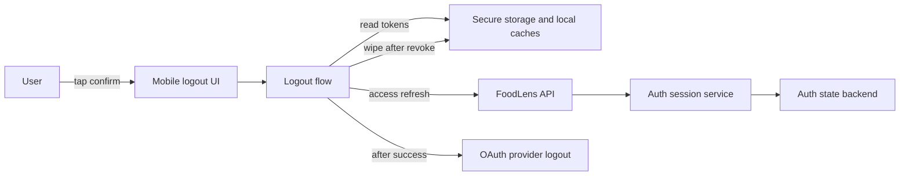

# FoodLens Logout Revoke and Session Residual Risk Threat Model

Date: 2026-05-31
Branch: `codex/logout-revoke-failure-handling`

## Executive summary

FoodLens logout is now modeled as current-device session revoke plus local privacy footprint wipe. The highest residual risks are not the mobile failure path itself, which now preserves the local session on server revoke failure, but the product and operations boundaries around it: production must prove shared auth state across instances, and suspected compromise still needs a separate all-session revoke UX/API.

## Scope and assumptions

In scope:

- Mobile logout from `ProfileSheet` and `ProfileHubScreen`.
- Mobile auth client, secure session storage, local logout footprint wipe, and provider logout handoff.
- Backend `/auth/logout`, refresh token rotation, session revoke state, auth state persistence, and Render auth-state config.
- Product decision record for current-device logout vs all-session logout.

Out of scope:

- Full OAuth login threat model, except where provider logout follows FoodLens logout.
- Account deletion and local deletion residue already covered by `docs/security/local-deletion-footprint-threat-model.md`.
- Rooted or jailbroken device extraction, OS keychain compromise, provider account takeover, and live provider API behavior.
- CI/build/release threats outside auth-state rollout verification.

Security decision record:

- General logout is current-device revoke. Evidence: active API contract lists `POST /auth/logout` with `refresh_token?` and bearer access token in `docs/contracts/api-contracts.md:162-165`, backend route is `@app.post("/auth/logout")` in `backend/server.py:5405-5423`, and service logout revokes only sessions resolved from the submitted access/refresh token in `backend/modules/auth/service.py:1992-2021`.
- Production auth-state posture is open for verification. Record as an operational check: confirm production uses `AUTH_STATE_BACKEND=postgres`, stable `AUTH_TOKEN_HASH_SECRET`, and multi-instance-consistent token/session revocation. Evidence: `render.yaml:15-24` declares web service `DATABASE_URL`, `AUTH_STATE_BACKEND=postgres`, and `AUTH_TOKEN_HASH_SECRET`; the runbook says production must satisfy those conditions in `docs/operations/oauth-security-runbook.md:40-54`; user context says actual production multi-instance posture remains unknown.
- If other logged-in devices are detected, the app should guide the user about logging out all devices. This is not implemented in this branch.
- Current server logout only revokes the session pointed to by submitted access/refresh token. All-session revoke UX/API is a follow-up, not in this branch. Evidence: design docs mention `/auth/logout-all` as breach recovery in `docs/plans/user-auth-rest-api-cto-spec.md:94-99` and Phase 2 in `docs/plans/user-auth-rest-api-draft.md:275-286,462-473`, while the active contract list in `docs/contracts/api-contracts.md:107-124` does not list `/auth/logout-all`.

Open questions that would change risk ranking:

- Has production actually verified shared auth runtime state across every running API instance, not just `render.yaml` intent?
- Is there a device/session inventory source the mobile app can use to detect "other logged-in devices"?
- Should password reset, suspicious login, or refresh-token reuse always drive all-session revoke once the follow-up API exists?

## System model

### Primary components

- Mobile logout UI: `FoodLens/components/ProfileSheet.tsx` and `FoodLens/features/profile/screens/ProfileHubScreen.tsx` call `runFoodLensLogoutFlow()`, show retryable failure alerts, and only navigate to `/login` after success. Evidence: `FoodLens/components/ProfileSheet.tsx:118-137`, `FoodLens/features/profile/screens/ProfileHubScreen.tsx:347-387`.
- Mobile logout orchestrator: `runFoodLensLogoutFlow()` reads the stored session, flushes sync, calls server logout, blocks local clear on server failure, wipes local footprint after server success, then returns success. Evidence: `FoodLens/services/auth/logoutFlow.ts:169-241`.
- Mobile auth API client: `AuthApi.logout()` sends bearer access token plus refresh token and requires `ok: true` in the server response. Evidence: `FoodLens/services/auth/authApi.ts:144-153,504-511`.
- Local storage and privacy wipe: `AuthSecureSessionStore` stores access/refresh tokens in Expo SecureStore when available, with volatile fallback for dev/native-module failure, and `clearLocalLogoutFootprint()` clears session, local stores, caches, sync queue, and managed image directory. Evidence: `FoodLens/services/auth/secureSessionStore.ts:103-167`, `FoodLens/services/auth/localFootprint.ts:58-103`.
- Backend auth route: `/auth/logout` extracts bearer access token and optional refresh token, delegates to `auth_service.logout()`, and returns `ok: true`, revoked count, and request id. Evidence: `backend/server.py:5405-5435`.
- Backend session service: access and refresh token records are keyed by token digests, session revoke flips `revoked_at` and token revoked/status fields, refresh reuse can revoke the token family. Evidence: `backend/modules/auth/service.py:568-579,1913-1990,1992-2021,2860-2913`.
- Auth state persistence: `from_env()` selects postgres when `DATABASE_URL` exists or `AUTH_STATE_BACKEND=postgres`; persisted token digests require `AUTH_TOKEN_HASH_SECRET`. Evidence: `backend/modules/auth/service.py:619-666,687-719`.

### Data flows and trust boundaries

- Mobile user -> mobile UI: logout intent crosses from trusted user action into app runtime. Data: tap/confirmation. Channel: React Native UI event. Security: confirmation dialog and loading guard. Evidence: `FoodLens/components/ProfileSheet.tsx:118-141`, `FoodLens/features/profile/screens/ProfileHubScreen.tsx:335-390`.
- Mobile secure storage -> mobile logout flow: access token, refresh token, user id, provider cross from OS-protected storage into JS runtime. Channel: Expo SecureStore read or volatile fallback. Security: SecureStore keychain options, parser rejects malformed session shape. Evidence: `FoodLens/services/auth/secureSessionStore.ts:62-80,103-123`.
- Mobile app -> backend API: bearer access token and refresh token cross the network to `/auth/logout`. Channel: HTTPS target from `ServerConfig`, JSON over HTTP. Security: authorization header, JSON body, request id, timeout, network error normalization. Evidence: `FoodLens/services/auth/authApi.ts:272-317,504-511`.
- Backend API -> auth session service: route extracts tokens and passes them to service revoke logic. Channel: in-process FastAPI call. Security: service resolves token digests to session ids, throws on missing session, persists state. Evidence: `backend/server.py:5405-5435`, `backend/modules/auth/service.py:1992-2021`.
- Auth service -> state backend: session/token digest state crosses to memory or Postgres. Channel: in-process memory or Postgres JSONB row. Security: table-name sanitization, required hash secret for persisted digest state, save/load error raising. Evidence: `backend/modules/auth/state_store.py:63-117,290-295`, `backend/modules/auth/service.py:687-719`.
- Mobile logout flow -> local wipe: after server revoke success, local tokens/caches/images/sync state are cleared. Channel: local storage APIs. Security: wipe tasks throw on failure and block success. Evidence: `FoodLens/services/auth/logoutFlow.ts:187-231`, `FoodLens/services/auth/localFootprint.ts:24-55,58-103`.
- Mobile logout flow -> provider logout bridge: provider logout starts only after FoodLens server/local success and failure does not roll back local logout. Channel: app browser/deep link. Security: warning-only provider failure after FoodLens logout. Evidence: `FoodLens/services/auth/logoutFlow.ts:243-252`, `FoodLens/services/auth/__tests__/logoutFlow.test.ts:215-241`.

#### Diagram

## Assets and security objectives

| Asset | Why it matters | Security objective (C/I/A) |
| --- | --- | --- |
| Access token | Lets caller authenticate until expiry if not revoked or expired | C/I |
| Refresh token | Lets caller mint replacement tokens and persist access | C/I |
| Session record and token digests | Authoritative backend revoke state | I/A |
| Auth state backend config | Determines whether revoke is shared across instances | I/A |
| Local SecureStore session | Device-resident account access after logout failure | C/I |
| Local caches, sync queue, images | Prior user's health-adjacent food/profile data can remain on device | C |
| Request ids and structured auth logs | Required to debug failed revoke without logging secrets | C/I/A |
| Provider logout state | External provider session may remain after FoodLens logout | C/I |

## Attacker model

### Capabilities

- Can use or observe an unlocked device where a FoodLens user tries to log out.
- Can interfere with network availability during logout, including timeout and transient 5xx scenarios.
- Can possess a refresh token for the current session or another device session through client compromise outside this model.
- Can replay old local UI assumptions, for example expecting logout to mean all devices.
- Can exploit production misconfiguration if API instances do not share auth session state.

### Non-capabilities

- Cannot bypass OS app sandboxing or directly extract SecureStore from a uncompromised device.
- Cannot compromise Postgres, Render, GitHub Actions, or provider infrastructure in this model.
- Cannot forge valid access/refresh tokens without first obtaining a token.
- Cannot force the backend to revoke arbitrary sessions unless the server exposes an all-session operation or the attacker controls a valid user-authenticated request that is authorized for it.

## Entry points and attack surfaces

| Surface | How reached | Trust boundary | Notes | Evidence (repo path / symbol) |
| --- | --- | --- | --- | --- |
| Mobile logout confirmation | Profile sheet or profile hub logout button | User -> mobile JS runtime | Must not navigate to login on server revoke failure | `FoodLens/components/ProfileSheet.tsx:118-137`, `FoodLens/features/profile/screens/ProfileHubScreen.tsx:347-387` |
| `AuthSecureSessionStore.read/clear` | Logout flow and session bootstrap | OS storage -> mobile JS runtime | SecureStore fallback is volatile, parser returns null for malformed session | `FoodLens/services/auth/secureSessionStore.ts:72-83,103-167` |
| `AuthApi.logout` | Called by logout flow | Mobile app -> backend HTTP | Sends bearer access token and refresh token, requires `ok: true` | `FoodLens/services/auth/authApi.ts:144-153,504-511` |
| `POST /auth/logout` | Mobile API call | Internet -> FastAPI app | Current-session revoke by submitted tokens, idempotent missing session response | `backend/server.py:5405-5435` |
| `InMemoryAuthSessionService.logout` | Backend route delegation | API route -> auth state | Resolves session ids from access/refresh token digests and revokes those sessions | `backend/modules/auth/service.py:1992-2021` |
| `refresh` | Mobile refresh path | Mobile app -> backend HTTP | Rotation marks old refresh token used and revokes family on reuse outside grace | `backend/modules/auth/service.py:1913-1990,2893-2913` |
| Postgres auth state store | Auth service startup and persistence | API instance -> Postgres | Requires `AUTH_TOKEN_HASH_SECRET` for persisted token digests | `backend/modules/auth/service.py:619-666,687-719`, `backend/modules/auth/state_store.py:63-117` |
| Provider logout start | After FoodLens logout success | App/browser -> provider bridge | Warning-only after server/local success, not a rollback control | `FoodLens/services/auth/logoutFlow.ts:243-252` |

## Top abuse paths

1. Attacker goal: keep access after user logs out on one phone. Steps: user has another logged-in device or attacker-held refresh token, user logs out current phone, server only revokes submitted session, other session remains usable. Impact: user believes account is closed everywhere when it is not.
2. Attacker goal: make logout appear complete while server revoke failed. Steps: attacker causes network timeout, app clears local tokens anyway, user lands on login and cannot retry revoke. Impact: stolen current-session refresh token remains valid. Current branch mitigates this by preserving local session on server failure.
3. Attacker goal: exploit production multi-instance state drift. Steps: logout hits API instance A, later refresh/auth hits instance B with stale memory state or inconsistent token hash secret, revoked token is accepted or invalidation behavior diverges. Impact: revoke loses security meaning in scale-out.
4. Attacker goal: abuse idempotent logout response as weak assurance. Steps: mobile sends stale/unknown tokens, backend returns `ok: true` revoked count 0, mobile wipes local state. Impact: local device is clean, but server-side assurance is only "no matching submitted session found."
5. Attacker goal: recover local user residue after server revoke. Steps: server revoke succeeds, local wipe task fails, app still routes to login. Impact: next device user sees previous user's local health-adjacent data. Current branch mitigates by treating local wipe failure as logout failure.
6. Attacker goal: use refresh token reuse. Steps: attacker reuses an old refresh token after rotation, server detects non-active token outside grace and revokes the token family. Impact: denial of account session continuity but reduced persistent theft window.
7. Attacker goal: learn token values from logs. Steps: logout or refresh failure emits structured logs. Impact: token theft if secrets are logged. Current evidence shows request id, user id, provider, codes, and statuses are logged, not token values.

## Threat model table

| Threat ID | Threat source | Prerequisites | Threat action | Impact | Impacted assets | Existing controls (evidence) | Gaps | Recommended mitigations | Detection ideas | Likelihood | Impact severity | Priority |
| --- | --- | --- | --- | --- | --- | --- | --- | --- | --- | --- | --- | --- |
| TM-001 | User misunderstanding, attacker with another active session | Same account has another active device/session, or attacker has another valid refresh token | User performs normal logout and assumes all devices are logged out | Other session can continue refreshing and accessing account | Refresh token, session record, user account | Current logout revokes only submitted-token sessions in `backend/modules/auth/service.py:1992-2021`; active contract has only `/auth/logout` in `docs/contracts/api-contracts.md:107-124` | No device inventory or `/auth/logout-all` in active contract | Add all-session revoke API/UX as follow-up; show guidance when other devices are detected; name current-device logout explicitly in product copy if inventory is unavailable | Alert on support/account-recovery events where users report "logged out but still active"; future metric for other active sessions at logout | medium | high | high |
| TM-002 | Network attacker, backend outage, client network failure | Current device has a valid session and server revoke request fails or times out | Force network/5xx failure during logout | Current-session refresh token could remain valid if app clears local state and user cannot retry | Refresh token, local session, user account | Logout flow retries timeout/network/5xx and returns `server_logout_failed` before local wipe in `FoodLens/services/auth/logoutFlow.ts:136-211`; UI tests assert no `/login` navigation on network failure in `FoodLens/components/__tests__/ProfileSheet.test.tsx:288-336` and `FoodLens/features/profile/screens/__tests__/ProfileHubScreen.test.tsx:546-585` | Repeated outages still leave user unable to complete logout | Keep retryable alert; consider background revoke retry queue only if it can safely preserve token material and show status | Count `[AuthSession] FoodLens server logout failed` by code/status/request id; page on sustained `AUTH_NETWORK_ERROR` or 5xx | medium | medium | medium |
| TM-003 | Operator error, scale-out misconfiguration | Production has multiple API instances or token hash secret drift, and auth state is not shared consistently | Logout/revoke on one runtime is not enforced by another runtime | Revoked access/refresh token may remain usable on some instances | Auth state backend, token digests, sessions | `render.yaml:15-24` declares postgres backend and hash secret; `from_env()` selects postgres with `DATABASE_URL` and requires hash secret in `backend/modules/auth/service.py:619-666,687-719`; runbook states prod requirements in `docs/operations/oauth-security-runbook.md:40-68` | User context says actual production multi-instance posture is unknown | Verify prod env has `AUTH_STATE_BACKEND=postgres`, stable `AUTH_TOKEN_HASH_SECRET`, same `AUTH_STATE_KEY/TABLE`, and multi-instance logout/refresh smoke evidence; block scale-out until verified | Run `backend/scripts/ci_auth_state_backend_smoke.py --expected-backend postgres --require-shared-state`; add live multi-instance revoke smoke before increasing instance count | medium until verified | high | high |
| TM-004 | Attacker with current-session token material | Attacker has access or refresh token for the same session being logged out | Try to authenticate or refresh after logout | Access should fail and refresh should not mint new tokens | Access token, refresh token, session record | Service marks session revoked and token records revoked/status revoked in `backend/modules/auth/service.py:2011-2021,2902-2913`; test denies revoked access after logout in `backend/tests/runtime/test_auth_service_rotation.py:77-95` | Revocation assurance depends on state backend consistency from TM-003 | Keep server-first logout; add integration smoke for logout then refresh/auth on deployed backend | Count `AUTH_TOKEN_INVALID`, `AUTH_SESSION_REVOKED`, and unexpected successful refresh after logout in staging smoke | low | high | medium |
| TM-005 | Local device reuse attacker | Server revoke succeeds but local cleanup fails or is incomplete | Use same device after logout to view prior account residue | Health-adjacent analysis, images, sync queue, cached identity leak locally | Local caches, images, sync queue, SecureStore session | Local wipe clears session, stores, pending jobs, AI/barcode cache, sync queue, managed image directory, and SafeStorage in `FoodLens/services/auth/localFootprint.ts:58-103`; mobile inventory records logout preserves session on revoke failure and wipes after success in `docs/mobile-feature-sync-inventory.md:38-39` | External photo library and rooted device extraction are out of scope | Keep logout failure on local wipe failure; keep regression tests from local deletion threat model | Alert on `[LocalFootprint] Local privacy footprint wipe failed`; QA account-switch and second-hand-device scenarios | medium | medium | medium |
| TM-006 | Stolen old refresh token holder | Refresh token was used before, attacker reuses it later | Trigger refresh reuse path | Server revokes token family, logging user out and limiting theft window | Refresh token family, active session continuity | Refresh marks old token used, and later reuse revokes family in `backend/modules/auth/service.py:1945-1970,2893-2913` | This controls reused tokens, not valid refresh tokens from another active device | Keep reuse detection; consider all-session revoke after suspicious login or user-initiated security action | Track `AUTH_REFRESH_REUSED` rate and affected user/session families | low | medium | medium |
| TM-007 | Log reader, support tooling, crash log pipeline | Logout/refresh failures emit structured logs | Extract tokens or OAuth secrets from logs | Token disclosure if logs include secrets | Access token, refresh token, OAuth state/proof values | Mobile logout logs only request id, user id, provider, phase, code/status/server request id in `FoodLens/services/auth/logoutFlow.ts:49-121`; backend logout logs request id and revoked count in `backend/server.py:5414-5435`; snapshot test asserts raw tokens are not persisted in runtime state in `backend/tests/runtime/test_auth_service_rotation.py:191-213`; runbook forbids OAuth secret logging in `docs/operations/oauth-security-runbook.md:5-10,91-92` | Error messages from lower layers must stay scrubbed | Keep structured fields; add log scrubbing checks for logout path if support log export grows | Secret scanner against logs; alert if `atk_`, `rtk_`, `refresh_token`, or OAuth verifier patterns appear | low | high | medium |

## Criticality calibration

- Critical: pre-auth or low-effort path to account-wide token theft, cross-user session acceptance in production, or provider callback/session issuance bypass. Example: revoked refresh tokens accepted across multiple API instances.
- High: authenticated or configuration-dependent path that keeps account access after user security action. Example: production scale-out without shared auth state, or current-device logout presented as all-device logout during compromise.
- Medium: realistic failure path with bounded user/account impact and existing controls. Example: network logout failure requiring retry, local wipe failure that blocks navigation.
- Low: issues needing unlikely preconditions or with easy detection and no durable account access. Example: idempotent `revoked_sessions=0` logout for already-invalid local tokens.

## Focus paths for security review

| Path | Why it matters | Related Threat IDs |
| --- | --- | --- |
| `FoodLens/services/auth/logoutFlow.ts` | Security sequencing lives here: server revoke must precede local wipe, and provider logout must not roll back FoodLens logout | TM-002, TM-005, TM-007 |
| `FoodLens/services/auth/authApi.ts` | Logout request shape, timeout/network normalization, and `ok: true` contract validation live here | TM-002, TM-004 |
| `FoodLens/components/ProfileSheet.tsx` | One of two user-visible logout entry points and failure alert paths | TM-001, TM-002 |
| `FoodLens/features/profile/screens/ProfileHubScreen.tsx` | Second user-visible logout entry point and failure alert paths | TM-001, TM-002 |
| `FoodLens/services/auth/localFootprint.ts` | Clears local tokens, caches, queue, and images after server revoke | TM-005 |
| `FoodLens/services/auth/secureSessionStore.ts` | Stores access/refresh tokens and defines volatile fallback behavior | TM-005, TM-007 |
| `backend/server.py` | Defines `/auth/logout` route semantics and idempotent missing-session response | TM-002, TM-004 |
| `backend/modules/auth/service.py` | Authoritative session, refresh rotation, family revoke, and logout revoke logic | TM-001, TM-004, TM-006 |
| `backend/modules/auth/state_store.py` | Postgres auth state persistence and table validation | TM-003 |
| `render.yaml` | Declares intended auth-state backend and secret wiring for Render services | TM-003 |
| `docs/operations/oauth-security-runbook.md` | Operational verification requirements for auth state and multi-instance rollout | TM-003, TM-007 |

## Quality check

- Covered discovered logout/session entry points: mobile profile logout UI, mobile auth API, backend `/auth/logout`, refresh, auth state persistence, provider logout handoff.
- Covered each modeled trust boundary in at least one threat: UI to logout flow, secure storage to JS, mobile to backend, backend to auth service, auth service to state backend, logout flow to local wipe, logout flow to provider logout.
- Separated runtime behavior from docs/plans and operational verification. `/auth/logout-all` is recorded as planned/follow-up, not active runtime.
- Reflected user-confirmed decisions: current-device general logout, unknown prod multi-instance auth-state posture, other-device guidance requirement, all-session revoke as follow-up.
- Assumptions and open verification items are explicit, especially production shared auth-state consistency and future device/session inventory.
